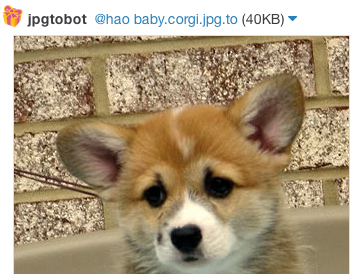

## Who let you in here?

Relax! I'm here to make your life easier. Has your company ever
switched to using [Slack](https://slack.com), and then you wanted to
write silly Slack bots in Haskell as a way to learn Haskell?

<sup>Really?<sup>Wow<sup>That was a pretty specific question.</sup></sup>

Uh, do you want to be friends? Well let's talk about it later, because right now I have an example for you.

But you'll have to grab me first:

* `cabal sandbox init`
* `cabal install linklater`

If you don't have Haskell, it's quite easy: [Windows](http://www.haskell.org/platform/), [Mac](http://ghcformacosx.github.io/), and [Linux](https://gist.githubusercontent.com/hlian/b5a975252997cb3e0020/raw/e4ecab3042225d321a88ee74e804c38ead38ed52/gistfile1.txt).

## Show me an example!

Here's a `/jpgto` bot. If you run this program and then tell Slack
about your server (incoming hook and custom slash command) and then
type `/jpgto diplomatico` in one of your channels, you'll get the
image from [http://diplomatico.jpg.to](http://diplomatico.jpg.to). How, you say? _Screen scraping_.

```haskell
import Network.Linklater (say, slash, Channel(..), Command(..), User(..), Config(..), Message(..), Icon(..))

findUrl :: Text -> Maybe Text
findUrl = fmap fromStrict . maybeResult . parse (manyTill (notChar '\n') (string "src=\"") *> takeTill (== '"'))

messageOf :: User -> Channel -> Text -> Text -> Message
messageOf (User u) c search = Message (EmojiIcon "gift") c . mappend (mconcat ["@", u, `", search, "`: "])

jpgto :: Maybe Command -> Application
jpgto (Just (Command user channel (Just text))) _ respond = do
  message <- get url >>= (return . fmap (messageOf user channel text) . findUrl . decodeUtf8 . flip (^.) responseBody)
  case (debug, message) of
    (True, _) -> putStrLn ("+ Pretending to post " <> show message) >> respondWith ""
    (False, Just m) -> config' >>= say m >> respondWith ""
    (False, Nothing) -> respondWith "Something went wrong!"
  where ourHeaders = [("Content-Type", "text/plain")]
        respondWith = respond . responseLBS status200 ourHeaders
        config' = (Config "trello.slack.com" . pack . filter (/= '\n')) <$> readFile "token"
        url = "http://" <> (unpack . intercalate "." . words $ text) <> ".jpg.to/"
        debug = False

main :: IO ()
main = let port = 3000 in putStrLn ("+ Listening on port " <> show port) >> run port (slash jpgto)
```

For the full example (since this one is missing a ton of imports), see
the `examples/` directory on GitHub.

Now! `/jpgto corgi`:



So easy. Much fast.

## Features

* Uses `Text` everywhere so you can send your slash commands crazy Unicode characters all day long.
* Lovely documentation.
* Battle-tested.


## Contributors

* [Hao Lian](https://hao.codes), author
* [Ian Henry](https://ianthehenry.com), design review and _future contributor_???
* *Shields* (the Grizzly Bear album), which I listened all the way through for the first time while I was writing this ★★★★
